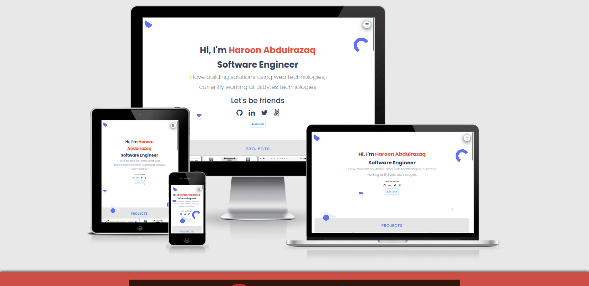

### Portfolio

Portfolio showcase my skills in web technologies,
It consist of all projects i have built and skills i am comfortable working with.

## :camera: Screenshot 

 
## Built With

- HTML5
- CSS3(Sass/Scss)
      [Flex]
      [Grid]
- JavaScript(ES6)

## :rocket: Live Demo
[LIVE DEMO LINK](https://haroonabdulrazaq.github.io/Portfolio/)

## :camera: Presentation 


## Work Done 🔧

- Use semantic HTML tags.
- Use CSS selectors correctly.
- Use HTML elements box model (margin, padding, width, height).
- Use industry-standard tools (flexbox & grid) to place elements in the page.
- Ability to create UIs adaptable to different screen sizes using mediaqueries.
- Apply front-end best practices.
- Ability to create UIs adjusted to given designs.

# Getting Started 🚀

These instructions will get you a copy of the project up and running on your local machine.

## How To Use 🔧

From your command line, first clone the project:  

```bash
# Clone this repository
$ git clone https://github.com/Haroonabdulrazaq/Portfolio.git

# Go into the repository
$ cd Portfolio

- Lunch in Editor of choice.

```
## Testing

- HTML Validator
- Stylelint
- Eslint

## Deploy
This project is deploy to Netlify and Github pages

## Author

👤 **Haroon Abdulrazaq**

- Github: [@githubhandle](https://github.com/Haroonabdulrazaq)
- Twitter: [@twitterhandle](https://twitter.com/hanq_o)
- Linkedin: [linkedin](https://www.linkedin.com/in/haroonabdulrazaq)

## Show your support

Give a ⭐️ if you like this project!

## Acknowledgments
- I appreciate Jonas SCHMEDTMAN for the animation techniques

## 📝 License

This project is [MIT](lic.url) licensed.

